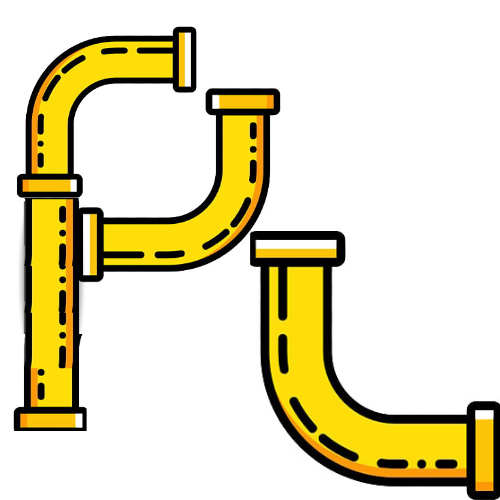

<h1 align="center">      PipeLine   </h1> <h4 align="center">A Django-powered gas utility portal connecting customers and support staff seamlessly — all through one PipeLine 💡</h4> 
 <a href="#key-features">Key Features</a> • <a href="#getting-started">Getting Started</a> • <a href="#usage">Usage</a> • <a href="#tech-stack">Tech Stack</a> • <a href="#license">License</a> 

📌 Why the name "PipeLine"?
It’s a wordplay on gas pipelines and the support workflow pipeline — a neat metaphor for connecting customer issues through a clean and efficient system.

🚀 Key Features
🔐 Role-based login for Customers and Support Representatives

📄 Multiple file attachment logic for support requests

✅ CSRF-protected forms for secure submissions

📬 Admin-side ticket management (optional)

🌐 Clean UI templates powered by HTML & CSS

📦 Modular Django app structure

🛠 Getting Started
To run this project locally, make sure you have Python and Django installed. Then:

bash
Copy
Edit
# Clone the repository
git clone https://github.com/yourusername/pipeline.git

# Go into the project directory
cd pipeline

# Install dependencies (ideally in a virtual environment)
pip install -r requirements.txt

# Run migrations
python manage.py migrate

# Run the development server
python manage.py runserver
Then open your browser and go to:
http://127.0.0.1:8000/

📸 Screenshots
Coming soon — Add UI screenshots here once you have login and dashboard templates!

💻 Usage
Visit / to land on the homepage.

Navigate to /customer/ for the customer login and features.

Navigate to /support/ for support staff access.

Submit issues with optional multiple file attachments.

Support reps can view and manage submitted issues.

🧰 Tech Stack
Python + Django (Backend)

HTML5 + CSS3 (Frontend)

SQLite3 (Default DB)

Optional: Add PostgreSQL, Celery, or Channels later for scalability

📄 License
This project is licensed under the MIT License — see the LICENSE file for details.

Made with 🧠 and ☕ by yourname
